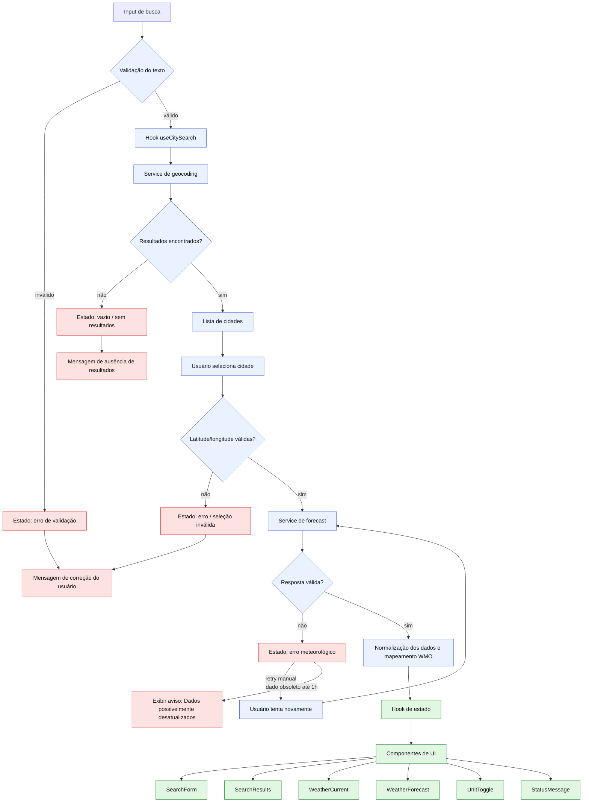

# Plano Técnico — Weather App

## Architecture

A aplicação será uma SPA (Single Page Application) em React com renderização no cliente, sem backend próprio. A arquitetura proposta é simples e orientada a responsabilidades bem definidas:

- Camada de UI: componentes React para busca, resultados, clima atual, previsão, toggle de unidade e estados de erro.
- Camada de serviços: adaptadores para geocoding e forecast, encapsulando fetch, timeout, validação e normalização de respostas.
- Camada de hooks: lógica reutilizável para busca, cache, estado de carregamento e leitura da preferência de unidade.
- Camada de lib: funções puras para sanitização de texto, conversão de temperatura, mapeamento de WMO e regras de validade de dados.

A estrutura de dados flui em uma sequência linear e previsível:

1. O usuário digita e envia a busca.
2. O input é normalizado e validado.
3. O sistema consulta geocoding e lista cidades relevantes.
4. A cidade selecionada define latitude/longitude e seu identificador.
5. O sistema consulta o forecast para a cidade selecionada.
6. Os dados são transformados para o contrato interno do app.
7. A UI apresenta o clima atual, a previsão e os estados de erro/carga.

A solução evita servidor, banco e state management global complexo. O escopo exige tempo de resposta rápido e consistência, mas não precisa de arquitetura distribuída ou de cache persistente além do navegador.

## Tech Stack

- React + Vite + TypeScript (strict mode)
- Tailwind CSS para visual com tema dark glassmorphism
- Biome para lint/format
- Vitest + Testing Library para testes unitários e componentes
- Playwright para testes E2E
- Open-Meteo como fonte única de dados meteorológicos
- Browser APIs nativas: fetch, localStorage, AbortController

Decisões de stack:

- React e Vite reduzem overhead de configuração e atendem ao MVP com boa produtividade.
- TypeScript strict ajuda a manter contratos claros entre dados vindos da API e a UI.
- Tailwind acelera a implementação visual sem necessidade de CSS modular pesado.
- Open-Meteo é compatível com a exigência de não depender de API key.
- localStorage é suficiente para persistir a unidade selecionada no navegador atual.

## Project Structure

A estrutura será orientada ao domínio do Weather App, mantendo simplicidade e baixa acoplamento:

- src/
  - components/
    - SearchForm
    - SearchResults
    - WeatherCurrent
    - WeatherForecast
    - UnitToggle
    - StatusMessage
    - FooterAttribution
  - hooks/
    - useCitySearch
    - useWeatherQuery
    - usePersistentUnit
  - services/
    - geocodingService
    - weatherService
    - apiClient
  - types/
    - weather.ts
    - api.ts
  - lib/
    - normalizeSearchText
    - temperature
    - wmoMapping
    - dateTime
    - validation
  - app/
    - App.tsx
    - main.tsx

Observações da estrutura:

- Cada componente fica em arquivo próprio, seguindo a convenção do projeto.
- A lógica de integração com APIs fica em services/, não misturada com componentes.
- Hooks encapsulam estados de carregamento e lógica de cache sem criar uma store global.
- Tipos compartilhados ficam em src/types/ para garantir contratos estáveis entre a UI, hooks, services e lib.

## Data Model

Os contratos internos abaixo representam a camada de domínio e devem ser respeitados entre serviço, hook e componente. Eles não são implementação final, apenas especificação de tipos/interfaces.

```ts
export type Unit = 'celsius' | 'fahrenheit';

export type WeatherStatus =
  | 'idle'
  | 'loading'
  | 'success'
  | 'empty'
  | 'error';

export interface City {
  id: number;
  name: string;
  country: string | null;
  admin1: string | null;
  latitude: number;
  longitude: number;
}

export interface SearchRequest {
  query: string;
  normalized: string;
}

export interface CurrentWeather {
  time: string | null;
  temperature: number | null;
  apparentTemperature: number | null;
  humidity: number | null;
  windSpeed: number | null;
  weatherCode: number | null;
  weatherLabel: string;
  weatherIcon: string;
  unit: Unit;
}

export interface ForecastDay {
  date: string;
  weatherCode: number | null;
  weatherLabel: string;
  weatherIcon: string;
  temperatureMin: number | null;
  temperatureMax: number | null;
  precipitationProbability: number | null;
}

export interface WeatherData {
  city: City;
  current: CurrentWeather;
  forecast: ForecastDay[];
  fetchedAt: string;
  isStale: boolean;
  staleReason?: string;
}

export interface ApiError {
  type: 'validation' | 'not-found' | 'network' | 'timeout' | 'http' | 'rate-limit' | 'unknown';
  message: string;
  recoverable: boolean;
  canRetry: boolean;
  statusCode?: number;
}
```

Regras de contrato importantes:

- `City` sempre preserva `id`, `latitude` e `longitude` fornecidos pela API.
- campos numericamente obrigatórios para renderização segura não podem ser inventados;
- quando ausentes, o app exibe `Indisponível`;
- `weatherLabel` e `weatherIcon` representam o mapeamento do WMO para texto e ícone em pt-BR, e `weatherCode` desconhecido não invalida a resposta.
- `WeatherData` representa a visão interna mais útil para a UI, com estado de frescor e possível dados obsoletos.
- `ApiError.type = 'rate-limit'` representa HTTP 429 e deve gerar mensagem específica de limite de consultas, sem retry automático imediato.

## Data Flow

O fluxo de dados será orientado por eventos do usuário e por regras de cache/validação.



1. Entrada do usuário
   - O texto digitado passa por normalização: trim, collapse de espaços e validação de faixa de caracteres.
   - Busca iniciada por botão ou Enter.

2. Busca por cidades
   - O input é enviado ao serviço de geocoding.
   - O endpoint retorna até 10 resultados, ordenados pela relevância da fonte.
   - O resultado é exibido com nome, região/estado e país quando disponíveis.

3. Seleção da cidade
   - O usuário seleciona uma cidade válida com latitude e longitude.
   - A aplicação registra a seleção e limpa estados anteriores de erro de forma controlada.

4. Consulta meteorológica
   - O serviço de forecast recebe latitude, longitude e unidade ativa.
   - Requisição usa `current`, `daily`, `timezone=auto`, `forecast_days=5` e unidade de temperatura escolhida.
   - O sistema também aplica timeout de 8 segundos.

5. Normalização e transformação
   - A resposta é validada por campos obrigatórios.
   - O WMO é mapeado para texto e ícone em pt-BR.
   - Temperaturas são convertidas conforme a unidade ativa.
   - Datas de previsão são mantidas conforme a API quando o timezone está presente; caso contrário, são exibidas sem recalcular no timezone do dispositivo.

6. Cache e atualização manual
  - A mesma cidade e unidade pode ser cacheada em memória por até 10 minutos, usando uma chave como `weather:${city.id}:${unit}`.
   - O botão Atualizar ignora o cache válido e força nova requisição.
   - Falhas e respostas inválidas não disparam automaticamente a consulta.

7. Orquestração e estado
   - O hook de estado recebe os resultados do geocoding e do forecast, controla carregamento, cache e dados obsoletos e decide qual estado exibir.
   - O estado central pode ser: inicial, carregando, vazio, sucesso, erro de validação, erro de busca, erro meteorológico ou dados possivelmente desatualizados.
   - Quando a busca não retorna cidades, o hook emite o estado vazio. Quando a resposta falha, ele preserva a mensagem de erro, o retry manual e, se houver, o dado stale com aviso explícito.
  - Cada consulta meteorológica deve usar `requestId` e `AbortController`; o resultado só pode atualizar a UI se ainda corresponder à cidade, unidade e request mais recentes.

8. Renderização da UI
   - Os componentes de UI recebem apenas o estado já decidido e os dados normalizados, sem acessar a API diretamente.
   - O fluxo de renderização separa a apresentação dos estados de erro e vazio, e os componentes exibem: busca, resultados, clima atual, previsão, toggle de unidade e mensagens de feedback.
   - O estado da UI varia entre inicial, carregamento, sucesso, vazio, erro e dados possivelmente desatualizados.
   - A interface informa o usuário sobre a natureza do problema e se há retry manual.

## External APIs

### Geocoding (Open-Meteo)

Endpoint principal:

- `https://geocoding-api.open-meteo.com/v1/search`

Parâmetros relevantes:

- `name`: texto da busca normalizado
- `language=pt`: retorna nomes em português
- `count=10`: limita a lista a 10 cidades
- `format=json`: resposta em JSON

Exemplo resumido de resposta JSON:

```json
{
  "results": [
    {
      "id": 3448439,
      "name": "São Paulo",
      "country": "Brazil",
      "admin1": "São Paulo",
      "latitude": -23.5489,
      "longitude": -46.6388
    },
    {
      "id": 3451190,
      "name": "São Paulo",
      "country": "Brazil",
      "admin1": "Rio de Janeiro",
      "latitude": -22.9068,
      "longitude": -43.1729
    }
  ]
}
```

Mapeamento para o modelo de dados:

- `results[].id` -> `City.id`
- `results[].name` -> `City.name`
- `results[].country` -> `City.country`
- `results[].admin1` -> `City.admin1`
- `results[].latitude` -> `City.latitude`
- `results[].longitude` -> `City.longitude`

Regras:

- usar Unicode válido e normalização de espaços;
- responder com `Indisponível` para campos ausentes;
- limitar a UI a 10 resultados.

### Forecast (Open-Meteo)

Endpoint principal:

- `https://api.open-meteo.com/v1/forecast`

Parâmetros relevantes:

- `latitude`: latitude da cidade selecionada
- `longitude`: longitude da cidade selecionada
- `current=temperature_2m,apparent_temperature,relative_humidity_2m,weather_code,wind_speed_10m`: campos do clima atual
- `daily=weather_code,temperature_2m_min,temperature_2m_max,precipitation_probability_max`: campos da previsão diária
- `forecast_days=5`: janela de 5 dias
- `timezone=auto`: mantém o timezone da cidade
- `temperature_unit=celsius|fahrenheit`: unidade selecionada no app

Exemplo resumido de resposta JSON:

```json
{
  "current": {
    "time": "2026-09-16T12:00",
    "temperature_2m": 27.4,
    "apparent_temperature": 28.7,
    "relative_humidity_2m": 61,
    "weather_code": 2,
    "wind_speed_10m": 14.2
  },
  "daily": {
    "time": ["2026-09-16", "2026-09-17", "2026-09-18", "2026-09-19", "2026-09-20"],
    "weather_code": [2, 1, 61, 80, 3],
    "temperature_2m_min": [22.1, 21.8, 20.9, 21.5, 22.3],
    "temperature_2m_max": [28.4, 29.1, 27.8, 27.0, 26.6],
    "precipitation_probability_max": [15, 25, 45, 60, 20]
  }
}
```

Mapeamento para o modelo de dados:

- `current.time` -> `CurrentWeather.time`
- `current.temperature_2m` -> `CurrentWeather.temperature`
- `current.apparent_temperature` -> `CurrentWeather.apparentTemperature`
- `current.relative_humidity_2m` -> `CurrentWeather.humidity`
- `current.wind_speed_10m` -> `CurrentWeather.windSpeed`
- `current.weather_code` -> `CurrentWeather.weatherCode`
- `daily.time[i]` -> `ForecastDay.date`
- `daily.weather_code[i]` -> `ForecastDay.weatherCode`
- `daily.temperature_2m_min[i]` -> `ForecastDay.temperatureMin`
- `daily.temperature_2m_max[i]` -> `ForecastDay.temperatureMax`
- `daily.precipitation_probability_max?.[i]` -> `ForecastDay.precipitationProbability`

Observações de integração:

- a lista `daily.time` deve ser usada como base para a previsão de 5 dias;
- quando `timezone=auto` estiver presente, a resposta já acompanha o timezone apropriado da cidade;
- se `timezone` não vier na resposta, a app usa as datas retornadas sem recalcular no timezone do dispositivo;
- `weather_code` desconhecido é mapeado para texto/ícone `Indisponível`, sem invalidar o restante da resposta.

Mapa WMO suportado:

- `0` → Céu limpo → `clear`
- `1` → Predominantemente limpo → `mostly-clear`
- `2` → Parcialmente nublado → `partly-cloudy`
- `3` → Nublado → `cloudy`
- `45`, `48` → Nevoeiro → `fog`
- `51`, `53`, `55` → Chuvisco → `drizzle`
- `56`, `57` → Chuvisco congelante → `freezing-drizzle`
- `61`, `63`, `65` → Chuva → `rain`
- `66`, `67` → Chuva congelante → `freezing-rain`
- `71`, `73`, `75`, `77` → Neve → `snow`
- `80`, `81`, `82` → Pancadas de chuva → `rain-showers`
- `85`, `86` → Pancadas de neve → `snow-showers`
- `95`, `96`, `99` → Tempestade → `thunderstorm`

Código WMO desconhecido:

- texto e ícone devem ser `Indisponível`;
- demais dados válidos continuam sendo exibidos;
- falha técnica deve ser registrada sem invalidar a previsão.

## State Management

A aplicação não precisará de uma biblioteca de estado global. A abordagem recomendada é:

- React state para estado local de UI e seleção do usuário;
- hooks customizados para encapsular busca, cache e leitura de preferências;
- localStorage para persistir `weather-app:unit`.

Estado principal esperado:

```ts
interface AppState {
  query: string;
  searchResults: City[];
  selectedCity: City | null;
  unit: Unit;
  weather: WeatherData | null;
  isSearching: boolean;
  isLoadingWeather: boolean;
  error: ApiError | null;
  emptyState: 'initial' | 'no-results' | 'not-selected';
}
```

Vantagens desta abordagem:

- baixa complexidade, fácil de testar;
- fácil de manter com o MVP;
- sem over-engineering nem bibliotecas adicionais para escopo pequeno.

A decisão de evitar estado global mais sofisticado é intencional: o app tem domínio pequeno e fluxo de dados linear. Em caso de crescimento, a state management pode ser revisado sem quebrar a arquitetura atual.

## Error Handling

A estratégia de tratamento de erros seguirá o critério da especificação, com mensagens em português do Brasil e recuperação manual quando aplicável.

### Tipos de erro

- Validação de busca: entrada vazia, espaços, excesso de caracteres, strings inválidas.
- ausência de resultados: busca sem coincidências válidas.
- erro de geocoding: problema de rede, timeout, HTTP 4xx/5xx, resposta inválida.
- erro meteorológico: falha na consulta do forecast ou resposta sem dados mínimos.
- stale data: resposta meteorológica com mais de 10 minutos e até 1 hora de idade, exibida somente em caso de falha do provedor.

### Regras

- 4xx: não repetir automaticamente.
- 429: mapear para `rate-limit`, informar que o limite de consultas foi atingido e não iniciar retries automáticos em loop.
- 5xx, timeout e falhas de rede: permitir retry manual.
- `AbortController` ou timeout de 8s para evitar requests indefinidas.
- respostas antigas devem ser descartadas por `requestId` quando chegarem depois de uma consulta mais recente.
- textos devem informar se o usuário pode corrigir a entrada ou tentar novamente.
- quando existir dado obsoleto em até 1 hora, exibir mensagem `Dados possivelmente desatualizados` e horário da última atualização.
- dados com mais de 1 hora não devem ser exibidos como previsão atual.

### Mensagens e acessibilidade

- cada estado de erro deve ser acessível por tecnologia assistiva;
- elementos visuais têm suporte textual claro;
- o app deve indicar estado de carregamento e ausência de resultados de forma inequívoca;
- o botão Atualizar deve estar disponível quando houver cidade selecionada.

## Testing Strategy

A estratégia é dividir a validação em três níveis: unitário, componente/integrado e E2E.

### Testes unitários

Cobrir funções puras e regras de negócio:

- normalização de texto de busca;
- validação de entrada (vazia, comprimento, espaços repetidos, Unicode);
- conversão Celsius/Fahrenheit;
- mapeamento de WMO para texto e ícone;
- regra de cache de 10 minutos;
- decisão de exibir dado stale vs. ocultar.

### Testes de componente

Verificar interações e renderização da UI:

- busca com clique e com tecla Enter;
- estado de carregamento;
- ausência de resultados;
- lista de cidades com nome, região/estado e país;
- seleção válida e inválida de cidade;
- renderização do clima atual e previsão diária;
- toggle de unidade e persistência local no navegador;
- mensagens de erro e ações de retry.

### Testes E2E

Cobrir fluxo completo do usuário:

- buscar cidade;
- selecionar a cidade correta;
- visualizar clima atual e previsão de 5 dias;
- alternar unidade de temperatura;
- manter preferência entre acessos no mesmo navegador;
- verificar comportamento em falha de rede ou resposta incompleta;
- descartar resposta obsoleta quando uma consulta anterior termina depois da consulta mais recente;
- validar a11y mínima de teclado e feedback visual;
- cobrir viewports 320x568, 768x1024 e 1440x900 e zoom de 200% em 1280 px.

### Hardening e release

- validar os fluxos críticos contra WCAG 2.2 AA;
- revisar compatibilidade nas duas versões estáveis mais recentes de Chrome, Edge, Firefox, Safari macOS, Safari iOS e Chrome Android;
- configurar Sentry para erros/performance do frontend e Web Vitals para métricas de experiência;
- prever monitor sintético de frontend e busca simulada como requisito de release, sem bloquear o primeiro slice de implementação do MVP.

### Cobertura e qualidade

- priorizar comportamento crítico e contratos de dados;
- evitar testes que dependam de mocks excessivos de UI em vez do comportamento real;
- tratar erros de integração como parte do fluxo do usuário, não apenas como unit tests isolados.

## Risks & Trade-offs

### Risco 1: dependência da qualidade do provedor

Open-Meteo pode retornar dados incompletos ou códigos WMO desconhecidos. A mitigação é tratar dados ausentes como opcionais e não falhar a renderização, preservando o restante da resposta.

### Risco 2: dados obsoletos

Exibir dados antigos pode gerar confusão, mas a especificação exige que seja possível mostrar dados possivelmente desatualizados após falha de provedor. A regra de até 1 hora e mensagem explícita reduz o risco de uso indevido.

### Risco 3: simplificação de estado

A ausência de store global reduz complexidade, mas pode ser menos escalável se a aplicação crescer. O trade-off é aceitável para o MVP, porque o domínio é simples e a arquitetura atual ainda é fácil de evoluir.

### Risco 4: sincronização de unidade e cache

Persistir a unidade no navegador e manter cache por cidade pode criar inconsistências se a seleção mudar rapidamente. A solução é centralizar a lógica em hooks, validar os valores persistidos antes de aplicar, usar cache por cidade + unidade e descartar respostas antigas por `requestId`.

### Risco 5: requisitos não funcionais de produção

Observabilidade, monitor sintético, compatibilidade entre navegadores e validação completa de WCAG 2.2 AA adicionam esforço que pode atrasar o primeiro slice. A decisão é tratá-los como hardening/release: planejados no MVP, mas executados depois dos fluxos essenciais de busca, seleção, previsão, unidade e erro.

### Trade-off principal

A arquitetura prioriza simplicidade, clareza e velocidade de implementação sobre extensibilidade máxima. Isso está alinhado com a spec e com a exigência de evitar over-engineering no MVP.

---

Conclusão do plano:

A solução proposta é um app de cliente único, com separação de responsabilidades clara, contratos de dados bem definidos, gestão de estado leve e foco em UX robusta para carregamento, erro e recuperação manual. O desenho atende ao escopo do MVP sem introduzir excesso de infraestrutura ou abstrações desnecessárias.
